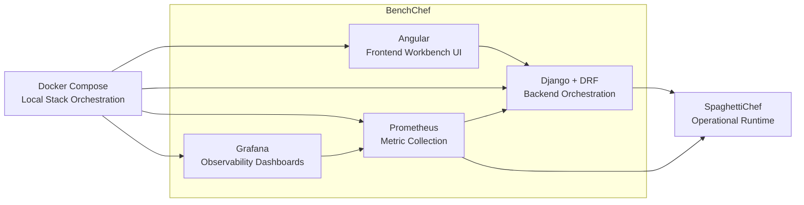

# BenchChef

> **WORK IN PROGRESS**

BenchChef is a performance supervision and benchmark workbench for SpaghettiChef.

BenchChef is designed to observe, measure, and analyze a running SpaghettiChef instance from the outside, while keeping the operational product lightweight and focused on its primary responsibilities.

## Related Project

BenchChef is designed to work with **SpaghettiChef**.

SpaghettiChef is the operational runtime responsible for printer/camera execution, dashboard/API behavior, and image-processing workflows.

Related repository:

[SpaghettiChef on GitHub](https://github.com/nathabee/spaghetti-chef)


SpaghettiChef is the operational runtime responsible for:

* printer runtime
* camera runtime
* dashboard and REST API
* engine execution
* image capture and processing

BenchChef is the complementary supervision and benchmark layer.

 

## Purpose

BenchChef focuses on:

* backend API performance
* frontend/dashboard responsiveness
* benchmark execution
* latency measurement
* throughput measurement
* availability monitoring
* CPU / RAM / disk observation
* technical reporting
* observability dashboards
* performance supervision workflows

BenchChef intentionally does **not** replace SpaghettiChef.

The architecture follows a **black-box monitoring approach**:

```text
SpaghettiChef performs the work.
BenchChef observes the work.
```

BenchChef measures performance primarily from outside the observed system.
 

## Technology Stack



SpaghettiChef = observed operational system
BenchChef = supervision layer
Angular -> Django
Prometheus collects metrics
Grafana visualizes metrics
Docker Compose orchestrates everything


## Architecture

```text
BenchChef
├── frontend-angular/   Angular frontend workbench
├── backend-django/     Django backend API and orchestration
├── prometheus/         Prometheus configuration
├── grafana/            Grafana dashboards and provisioning
├── scenarios/          Benchmark scenario definitions
├── reports/            Generated benchmark reports
└── docs/               Documentation
```

## Implementation Status


| Version | Status      | Goal                                                              |
| ------- | ----------- | ----------------------------------------------------------------- |
| 0.1.x   | DONE        | Project foundation (Angular, Django, Prometheus, Grafana, Docker) |
| 0.2.x   | DONE        | Django backend foundation                                         |
| 0.3.x   | DONE        | SpaghettiChef connection layer                                    |
| 0.4.x   | IN PROGRESS | Black-box performance probes                                      |
| 0.5.x   | PLANNED     | Prometheus integration                                            |
| 0.6.x   | PLANNED     | External system metrics                                           |
| 0.7.x   | PLANNED     | Grafana dashboards                                                |
| 0.8.x   | PLANNED     | Angular workbench UI                                              |
| 0.9.x   | PLANNED     | Benchmark scenario runner                                         |
| 1.0.x   | PLANNED     | Reports and portfolio release                                     |

Detailed status :  [roadmap](/docs/roadmap.md).


## Local Development

Start the monitoring stack:

```bash
docker compose up -d
```

Open:

```text
Prometheus  http://localhost:9090
Grafana     http://localhost:3000
```

Stop:

```bash
docker compose down
```

## License

BenchChef is distributed under the terms of the [MIT License](LICENSE).