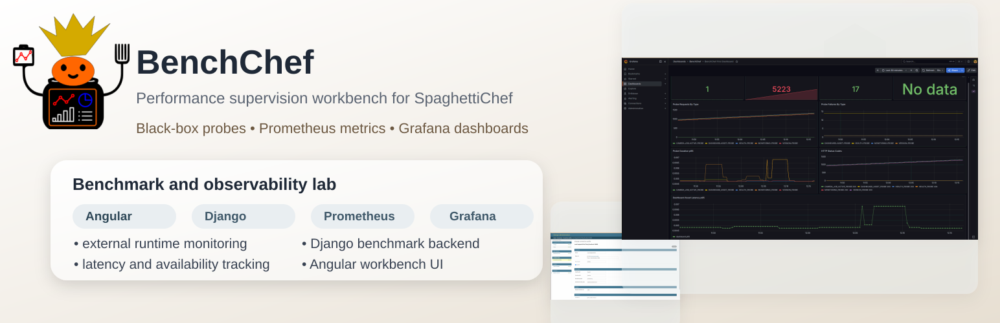
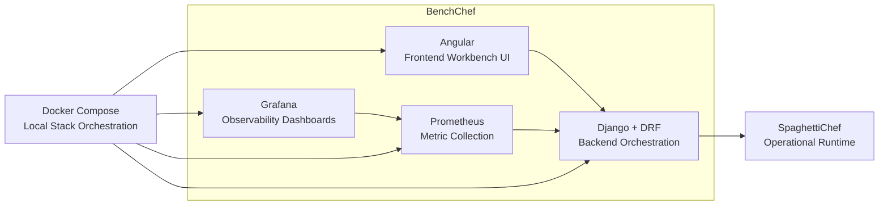

<p align="center">
  
</p>


# BenchChef

> **WORK IN PROGRESS**

BenchChef is a performance supervision and benchmark workbench for SpaghettiChef.

BenchChef observes, measures, and analyzes a running SpaghettiChef instance from the outside, while keeping SpaghettiChef lightweight and focused on printer, camera, dashboard, and engine execution.

## Related Project

BenchChef is designed to work with **SpaghettiChef**.

Related repository:

[SpaghettiChef on GitHub](https://github.com/nathabee/spaghetti-chef)

SpaghettiChef is the operational runtime responsible for:

* printer runtime
* camera runtime
* dashboard and REST API
* engine execution
* image capture and processing

BenchChef is the complementary supervision and benchmark layer.

## Purpose

BenchChef focuses on:

* backend API performance
* frontend/dashboard responsiveness
* benchmark execution
* latency measurement
* throughput measurement
* availability monitoring
* observability dashboards
* technical reporting
* performance supervision workflows

BenchChef intentionally does **not** replace SpaghettiChef.

```text
SpaghettiChef performs the work.
BenchChef observes the work.
````

## Technology Stack



## Architecture

```text
BenchChef
├── frontend-angular/   Angular frontend workbench
├── backend-django/     Django backend API and orchestration
├── prometheus/         Prometheus configuration
├── grafana/            Grafana dashboards and provisioning
├── scenarios/          Benchmark scenario definitions
├── reports/            Generated benchmark reports
└── docs/               Documentation
```

## Implementation Status

| Version | Status      | Goal                                  |
| ------- | ----------- | ------------------------------------- |
| 0.1.x   | DONE        | Project foundation                    |
| 0.2.x   | DONE        | Django backend foundation             |
| 0.3.x   | DONE        | SpaghettiChef connection layer        |
| 0.4.x   | DONE        | Black-box performance probes          |
| 0.5.x   | DONE        | Prometheus integration                |
| 0.6.x   | DONE        | First Grafana dashboard               |
| 0.7.x   | PLANNED     | External system metrics               |
| 0.8.x   | PLANNED     | Full Grafana observability dashboards |
| 0.9.x   | PLANNED     | Angular workbench UI                  |
| 0.10.x  | PLANNED     | Benchmark scenario runner             |
| 1.0.x   | PLANNED     | Reports and BenchChef release         |

Detailed roadmap: [docs/roadmap.md](docs/roadmap.md).

## Local Development

BenchChef can be started with helper scripts.
Create a ".env" file (use .env.example), modify ports if necessary :
Start the local stack:

```bash
./scripts/start.sh
```

This starts:

```text
SpaghettiChef runtime
BenchChef Django backend
BenchChef Angular frontend
Prometheus
Grafana
diagnostics loop
```

Open:

```text
BenchChef Angular  http://localhost:18072
BenchChef Backend  http://localhost:18090
Prometheus         http://localhost:9090
Grafana            http://localhost:3000
```

Default Grafana login:

```text
user: admin
password: admin
```

Check running processes:

```bash
./scripts/ps.sh
```

Check stored process ids:

```bash
./scripts/pid.sh
```

Stop the local stack:

```bash
./scripts/stop.sh
```

## Useful Prometheus Queries

```text
benchchef_probe_requests_total
benchchef_probe_failures_total
benchchef_probe_duration_seconds_count
benchchef_probe_http_status_total
benchchef_spaghettichef_up
```

## Grafana

Grafana is provisioned automatically.

Datasource:

```text
Prometheus
```

Dashboard:

```text
BenchChef First Dashboard
```

The dashboard uses BenchChef metrics exported by Django and scraped by Prometheus.

## License

BenchChef is distributed under the terms of the [MIT License](LICENSE).
 