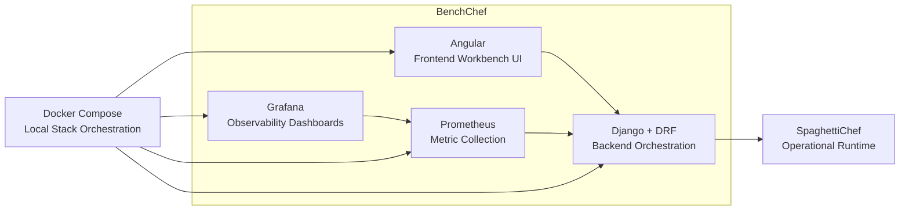

<p align="center">
  
</p>


# BenchChef

> **WORK IN PROGRESS**

BenchChef is a performance supervision and benchmark workbench for SpaghettiChef.

BenchChef observes, measures, and analyzes a running SpaghettiChef instance from the outside, while keeping SpaghettiChef lightweight and focused on printer, camera, dashboard, and engine execution.


## Purpose

BenchChef focuses on:

* backend API performance
* frontend/dashboard responsiveness
* benchmark execution
* latency measurement
* throughput measurement
* availability monitoring
* observability dashboards
* technical reporting
* performance supervision workflows

BenchChef intentionally does **not** replace SpaghettiChef.

```text
SpaghettiChef performs the work.
BenchChef observes the work.
```

## Related Project

BenchChef is designed to work with **SpaghettiChef**.

Related repository:

[SpaghettiChef on GitHub](https://github.com/nathabee/spaghetti-chef)

SpaghettiChef is the operational runtime responsible for:

* printer runtime
* camera runtime
* dashboard and REST API
* engine execution
* image capture and processing

BenchChef is the complementary supervision and benchmark layer.


## Technology Stack



## Architecture

```text
BenchChef
├── frontend-angular/   Angular frontend workbench
├── backend-django/     Django backend API and orchestration
├── prometheus/         Prometheus configuration
├── grafana/            Grafana dashboards and provisioning
├── scenarios/          Benchmark scenario definitions
├── reports/            Generated benchmark reports
└── docs/               Documentation
```

## Implementation Status

| Version | Status      | Goal                                  |
| ------- | ----------- | ------------------------------------- |
| 0.1.x   | DONE        | [Project foundation](docs/TODOs/TODO.0.1-Foundation.md) |
| 0.2.x   | DONE        | [Django backend foundation](docs/TODOs/TODO.0.2-Backend.md) |
| 0.3.x   | DONE        | [SpaghettiChef connection layer](docs/TODOs/TODO.0.3-SpaghettiChef-Connect.md) |
| 0.4.x   | DONE        | [Black-box performance probes](docs/TODOs/TODO.0.4-BlackBox.md) |
| 0.5.x   | DONE        | [Prometheus integration](docs/TODOs/TODO.0.5-Prometheus.md) |
| 0.6.x   | DONE        | [First Grafana dashboard](docs/TODOs/TODO.0.6-Grafana.md) |
| 0.7.x   | DONE        | [External system metrics](docs/TODOs/TODO.0.7-External-System-Metrics.md) |
| 0.8.x   | DONE        | [Full Grafana observability dashboards](docs/TODOs/TODO.0.8-Grafana-Observability.md) |
| 0.9.x   | IN PROGRESS | [Angular workbench UI](docs/TODOs/TODO.0.9-Angular-Workbench.md) |
| 0.10.x  | IN PROGRESS | [Release packaging and remote install](docs/TODOs/TODO.0.10-Release.md) |
| 0.11.x  | PLANNED     | [Benchmark scenario runner](docs/TODOs/TODO.0.11-Benchmark-Scenario-Runner.md) |
| 1.0.x   | PLANNED     | [BenchChef Central sync boundary](docs/TODOs/TODO.1.0-BenchChef-Central-Sync-Boundary.md) |
| 1.1.x   | PLANNED     | [BenchChef Central backend](docs/TODOs/TODO.1.1-BenchChef-Central-Backend.md) |
| 1.2.x   | PLANNED     | [BenchChef Central dashboards](docs/TODOs/TODO.1.2-BenchChef-Central-Dashboards.md) |
| 2.0.x   | PLANNED     | [Reports and release workflow](docs/TODOs/TODO.2.0-Reports-Release.md) |
| 2.1.x   | PLANNED     | [Support reports and PDF export](docs/TODOs/TODO.2.1-Support-Reports-PDF.md) |
| 3.0.x   | PLANNED     | [Kotlin REST client](docs/TODOs/TODO.3.0-Kotlin-REST-Client.md) |
| 3.1.x   | PLANNED     | [Android support client](docs/TODOs/TODO.3.1-Android-Support-Client.md) |

Detailed roadmap: [docs/roadmap.md](docs/roadmap.md).

## Local Development

BenchChef can be started with helper scripts.
Create a ".env" file (use .env.example), modify ports if necessary :
By default, BenchChef expects SpaghettiChef to already be reachable at:

```text
SPAGHETTICHEF_BASE_URL=http://localhost:18080
```

BenchChef does not start SpaghettiChef. The start script checks the configured
URL and warns if SpaghettiChef is unavailable; BenchChef still starts so probes
can be launched after SpaghettiChef comes online.

Start the local stack:

```bash
./scripts/start.sh
```

This starts:

```text
BenchChef Django backend
BenchChef Angular frontend
Prometheus
Grafana
node_exporter
process-exporter
optional diagnostics loop
```

Open:

```text
BenchChef Angular  http://localhost:18072
BenchChef Backend  http://localhost:18071
Prometheus         http://localhost:18073
Grafana            http://localhost:18074
node_exporter      http://localhost:18075/metrics
process-exporter   http://localhost:18076/metrics
```

Default Grafana login:

```text
user: admin
password: admin
```

Check running processes:

```bash
./scripts/ps.sh
```

Check stored process ids:

```bash
./scripts/pid.sh
```

Stop the local stack:

```bash
./scripts/stop.sh
```

## Useful Prometheus Queries

```text
benchchef_probe_requests_total
benchchef_probe_failures_total
benchchef_probe_duration_seconds
benchchef_probe_http_status_total
benchchef_probe_timeout_total
benchchef_spaghettichef_up
node_memory_MemAvailable_bytes
rate(namedprocess_namegroup_cpu_seconds_total[5m])
```

## Grafana

Grafana is provisioned automatically.

Datasource:

```text
Prometheus
```

Dashboard:

```text
BenchChef First Dashboard
BenchChef Observability 0.8
```

The dashboard uses BenchChef metrics exported by Django and scraped by Prometheus.

To generate data for the dashboard, run diagnostics and dashboard responsiveness
probes as described in [docs/grafana.md](docs/grafana.md).

 

## Documentation

* [Installation and Operation](docs/install.md)
* [Smoke Tests](docs/test.md)
* [SpaghettiChef Compatibility](docs/spaghettichef-compatibility.md)
* [Metrics Overview](docs/metrics.md)
* [Grafana Integration](docs/grafana.md)
* [External System Metrics](docs/system-metrics.md)
* [Remote Install](docs/install-remote.md)
* [Roadmap](docs/roadmap.md)
* [Version TODOs](docs/TODOs/README.md)


## License

BenchChef is distributed under the terms of the [MIT License](LICENSE).
 
