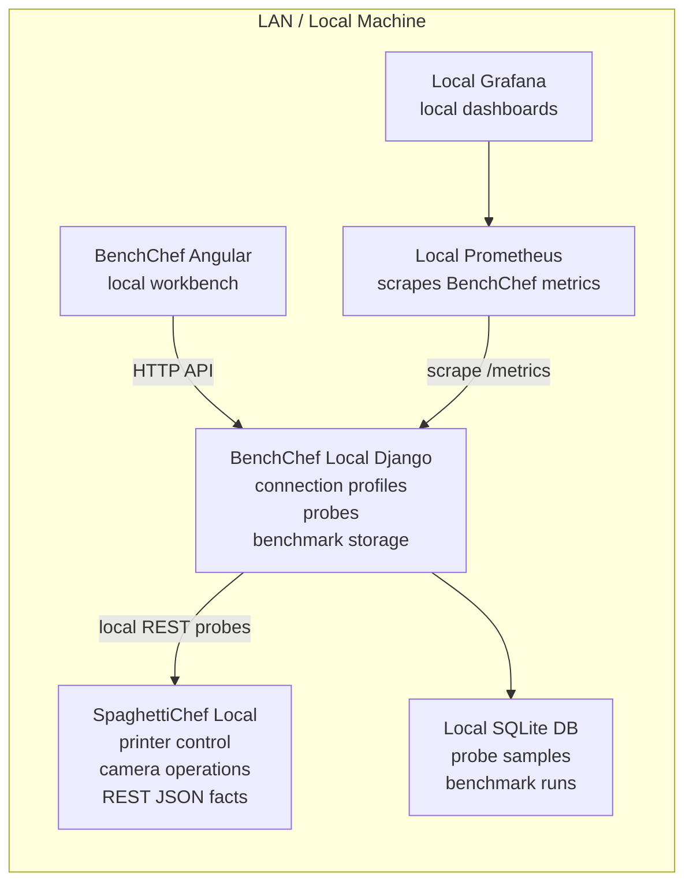
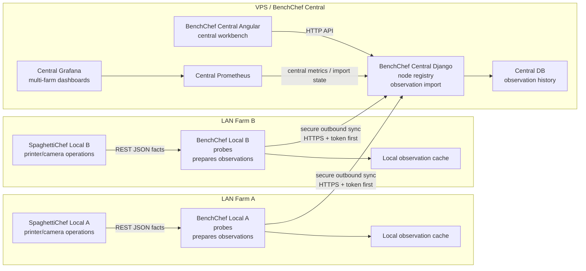

# BenchChef Architecture

BenchChef has two deployment shapes: a local-only workbench and a future
central architecture with one BenchChef Central receiving observations from
multiple BenchChef Local instances.

## Local Only

In local-only mode, all BenchChef services run close to SpaghettiChef Local.
This is the current practical setup for development, LAN testing, and small
farms.



Local-only mode may run Django, Angular, Prometheus, and Grafana all on the
same host. Users open local URLs such as `http://localhost:18072`.

### What Starts In Local-Only Mode

Start SpaghettiChef separately in local mode. BenchChef does not start
SpaghettiChef.

Start BenchChef Local with the local start script:

```text
Linux:   ./scripts/start.sh
Windows: C:\benchchef\bin\r.ps1
```

This starts:

```text
BenchChef Django backend
BenchChef Angular frontend
Prometheus
Grafana
local BenchChef database
```

On Linux development installs, local host exporters may also be started:

```text
node_exporter
process-exporter
```

On Windows release installs, only Prometheus and Grafana run in Docker.
Django and Angular run as native Windows processes.

## Central Plus N Locals

In the central architecture, SpaghettiChef Local remains inside the LAN and is
never called directly by BenchChef Central. BenchChef Local is the boundary: it
collects or prepares observations and sends them outward.



In this mode, local Prometheus and Grafana are optional debugging tools. The
central dashboards live on the VPS. BenchChef Central communicates with
BenchChef Local, not with SpaghettiChef Local, and it does not require
SpaghettiChef Central.

### What Starts In Each LAN Farm

Each LAN farm starts SpaghettiChef Local separately in local operational mode.
It remains responsible for printers, cameras, snapshots, deltas, and REST JSON
facts.

Each LAN farm also starts BenchChef Local:

```text
BenchChef Local Django backend
BenchChef Local database or local observation cache
BenchChef Local sync sender
optional BenchChef Local Angular frontend for local operation
optional local Prometheus and Grafana for debugging
```

The farm does not expose SpaghettiChef Local REST APIs to the public internet.
BenchChef Local is the component allowed to call SpaghettiChef Local inside the
LAN.

### What Starts On The VPS

The VPS starts BenchChef Central only:

```text
BenchChef Central Django backend
BenchChef Central Angular frontend
central database
central Prometheus
central Grafana
```

BenchChef Central receives or imports observations from BenchChef Local
instances. It does not start SpaghettiChef, does not call SpaghettiChef Local
directly, and does not require SpaghettiChef Central.
