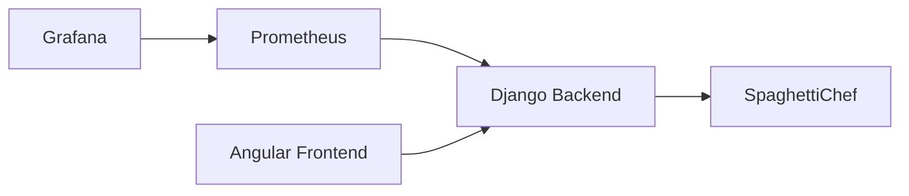

# Installation and Operation

## Purpose

This document explains how to start, stop, and access a local BenchChef environment.

## Architecture



## Configuration

BenchChef uses values from:

```text
.env
```

Typical ports:

```text
BENCHCHEF_BACKEND_PORT
BENCHCHEF_FRONTEND_PORT
PROMETHEUS_PORT
GRAFANA_PORT
NODE_EXPORTER_PORT
PROCESS_EXPORTER_PORT
PORTSPAGHETTICHEF
SPAGHETTICHEF_DIR
```

`SPAGHETTICHEF_DIR` points to a local SpaghettiChef checkout. BenchChef and
SpaghettiChef are expected to live next to each other by default:

```text
github/
├── bench-chef/
└── spaghetti-chef/
```

SpaghettiChef is not started through BenchChef Docker Compose. The start script
runs it from the sibling checkout with Maven.

## Start

```bash
./scripts/start.sh
```

This starts:

```text
SpaghettiChef
BenchChef Django Backend
BenchChef Angular Frontend
Prometheus
Grafana
node_exporter
process-exporter
Diagnostics Loop
```

## Stop

```bash
./scripts/stop.sh
```

## Process Information

Show process ids:

```bash
./scripts/pid.sh
```

Show running processes:

```bash
./scripts/ps.sh
```

## URLs

```text
Angular           http://localhost:18072
Backend           http://localhost:18071
Prometheus        http://localhost:18073
Grafana           http://localhost:18074
node_exporter     http://localhost:18075/metrics
process-exporter  http://localhost:18076/metrics
```

## Grafana Login

```text
User:     admin
Password: admin
```

Password may be changed locally.
