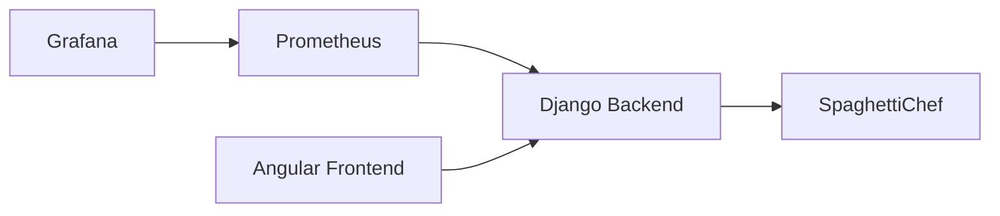

# Installation and Operation

## Purpose

This document explains how to start, stop, and access a local BenchChef environment.

## Architecture



## Configuration

BenchChef uses values from:

```text
.env
```

Typical ports:

```text
BENCHCHEF_BACKEND_PORT
BENCHCHEF_FRONTEND_PORT
PROMETHEUS_PORT
GRAFANA_PORT
PORTSPAGHETTICHEF
```

## Start

```bash
./scripts/start.sh
```

This starts:

```text
SpaghettiChef
BenchChef Django Backend
BenchChef Angular Frontend
Prometheus
Grafana
Diagnostics Loop
```

## Stop

```bash
./scripts/stop.sh
```

## Process Information

Show process ids:

```bash
./scripts/pid.sh
```

Show running processes:

```bash
./scripts/ps.sh
```

## URLs

```text
Angular      http://localhost:18072
Backend      http://localhost:18090
Prometheus   http://localhost:9090
Grafana      http://localhost:3000
```

## Grafana Login

```text
User:     admin
Password: admin
```

Password may be changed locally.
