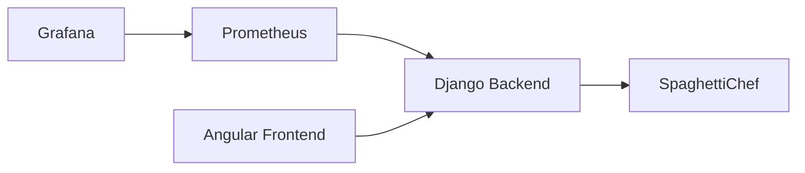

# Installation And Operation

## Purpose

This document explains how to install, start, stop, and access a local BenchChef
environment.

BenchChef can be used in two ways:

```text
development checkout  run from the Git repository
release package       install from Jenkins/GitHub release assets
```

SpaghettiChef remains a separate local runtime. BenchChef observes it but does
not install or own it.

## Architecture



## Development Checkout

Use this path when working directly in the Git repository.

### Configuration

BenchChef uses values from:

```text
.env
```

Typical ports:

```text
BENCHCHEF_BACKEND_PORT
BENCHCHEF_FRONTEND_PORT
PROMETHEUS_PORT
GRAFANA_PORT
NODE_EXPORTER_PORT
PROCESS_EXPORTER_PORT
SPAGHETTICHEF_BASE_URL
```

`SPAGHETTICHEF_BASE_URL` points to the SpaghettiChef runtime that BenchChef
should observe:

```text
SPAGHETTICHEF_BASE_URL=http://localhost:18080
```

BenchChef does not start SpaghettiChef. The start script checks the configured
URL and warns if SpaghettiChef is unavailable; BenchChef still starts so probes
can be launched after SpaghettiChef comes online.

### Start

```bash
./scripts/start.sh
```

This starts:

```text
BenchChef Django Backend
BenchChef Angular Frontend
Prometheus
Grafana
node_exporter
process-exporter
optional diagnostics loop
```

### Stop

```bash
./scripts/stop.sh
```

### Process Information

Show process ids:

```bash
./scripts/pid.sh
```

Show running processes:

```bash
./scripts/ps.sh
```

## Release Install

BenchChef release assets are produced by Jenkins and attached to a GitHub
release.

Expected assets:

```text
bench-chef-<version>-release.tar.gz
bench-chef-<version>-linux.tar.gz
bench-chef-<version>-windows.zip
bench-chef-<version>-admin.zip
SHA256SUMS.txt
```

Use the Linux package for a Linux BenchChef host, the Windows package for a
Windows BenchChef host, and the admin package for operational helper scripts.

### Linux Release Install

Requirements:

```text
Docker
Docker Compose
Python 3
Node.js and npm
SpaghettiChef installed separately
```

Install the package:

```bash
mkdir -p ~/benchchef
tar -xzf bench-chef-<version>-linux.tar.gz -C ~/benchchef --strip-components=1
cd ~/benchchef
```

Create the local configuration:

```bash
cp .env.example .env
```

Review `.env`, especially:

```text
SPAGHETTICHEF_BASE_URL
BENCHCHEF_BACKEND_PORT
BENCHCHEF_FRONTEND_PORT
PROMETHEUS_PORT
GRAFANA_PORT
```

Start:

```bash
./scripts/start.sh
```

Verify:

```bash
./scripts/ps.sh
```

Stop:

```bash
./scripts/stop.sh
```

### Windows Release Install

Windows installs use:

```text
bench-chef-<version>-windows.zip
bench-chef-<version>-admin.zip
```

The default Windows layout is:

```text
C:\benchchef\
├── app\
├── bin\
├── data\
├── log\
├── rel\
└── tmp\
```

Short version:

```text
extract bench-chef-<version>-windows.zip into C:\benchchef\app
copy admin\win\* from bench-chef-<version>-admin.zip into C:\benchchef\bin
copy C:\benchchef\bin\run.env.example to C:\benchchef\data\run.env
run C:\benchchef\bin\r.ps1
run C:\benchchef\bin\v.ps1
```

For the full Windows bootstrap, scheduled task setup, remote update, and Linux
admin helper commands, see [Remote Windows Install And Update](install-remote.md).

## URLs

```text
Angular           http://localhost:18072
Backend           http://localhost:18071
Prometheus        http://localhost:18073
Grafana           http://localhost:18074
node_exporter     http://localhost:18075/metrics
process-exporter  http://localhost:18076/metrics
```

## Grafana Login

```text
User:     admin
Password: admin
```

Password may be changed locally.
